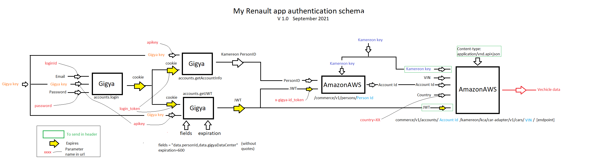

# myRenaultLC
 Standalone browser page to access Renault vehicles data
 
Available here: http://jumpjack.altervista.org/myrenault
 
 **Note: the page is experimenal, use at your own risk ==

Fill in your MyRenault credentials (email and password), then select the endpoint from the list, and click QUERY button. Some endpoints have two versions available, depending on your car: try both; if the endpoint exists, you'll see the output in the output panel, else you'll see a "404" error if endpoint does not exists, or other numbers if you missed some additional parameters in the endpoint.

MyRenault endpoints encyclopaedia:

 - https://renault-api.readthedocs.io/en/latest/endpoints.html
 - https://github.com/hacf-fr/renault-api/wiki

Security warning
----------------

If you don't want to fill-in your credentials in an unknown page, download the page to your PC: you will get an index.html file and many .js files into same folder. Just open index.html in your favourite browser and start testing.

Since version 2.4.0 the web page uses a php script ( https://github.com/jumpjack/myRenaultLC/blob/main/gigya-login.php ) located in its own folder to perform authentication on Gigya server; the user can use the script he prefers, as long as it returns this structure:

	{
		"loginData" : {
			"cookie" : "xxxxxxxxxxxxxxxxxx" ,
			"JWT" : "xxxxxxxxxxxxxxxxxx",
			"personId" : "xxxxxxxxxxxxxxxxxx"
		}
	}

Syntax for calling the script:

    /gigya-login.php?gigyakey=XXXXXXXXX&gigyasite=XXXXXXXX&kamereon=XXXXXXXX&username=XXXXXXXXX&password=XXXXXXXX

- gigyakey:  see https://github.com/jumpjack/myRenaultLC/blob/main/myrenault-public.js
- gigyasite: see https://github.com/jumpjack/myRenaultLC/blob/main/myrenault-public.js
- kamereon:  see https://github.com/jumpjack/myRenaultLC/blob/main/myrenault-public.js
- username: Of MyRenault app
- password: Of MyRenault app

---------

Alternatives
-------------

 - Python APIs (you will need to install Python and operate by command line):
    - https://github.com/hacf-fr/renault-api  
    - https://github.com/jamesremuscat/pyze (from the author of the initial blog post about Renault APIs: https://muscatoxblog.blogspot.com/2019/07/delving-into-renaults-new-api.html)
    - https://github.com/ECOM-Engineering/renault-api/blob/main/src/renault_api/renault_vehicle.py

 - PHP pages (require PHP server):
   - https://github.com/db-EV/ZoePHP
   - https://github.com/m0qui/phpze

- NODE js (javascript server side):
   - https://github.com/rikardwissing/node-my-renault-api
 
 
 - ioBroker-Adapter: https://github.com/fungus75/ioBroker.zoe2  (ioBroker: https://www.iobroker.net/)
 - iOS widget (javascript): https://gist.github.com/mountbatt/772e4512089802a2aa2622058dd1ded7

 - Search for myrenault <a href="https://github.com/search?q=myrenault">in all github</a>

Credits
-------

Original idea from: https://muscatoxblog.blogspot.com/2019/07/delving-into-renaults-new-api.html

My graphical interpretation of login process described in above page:

